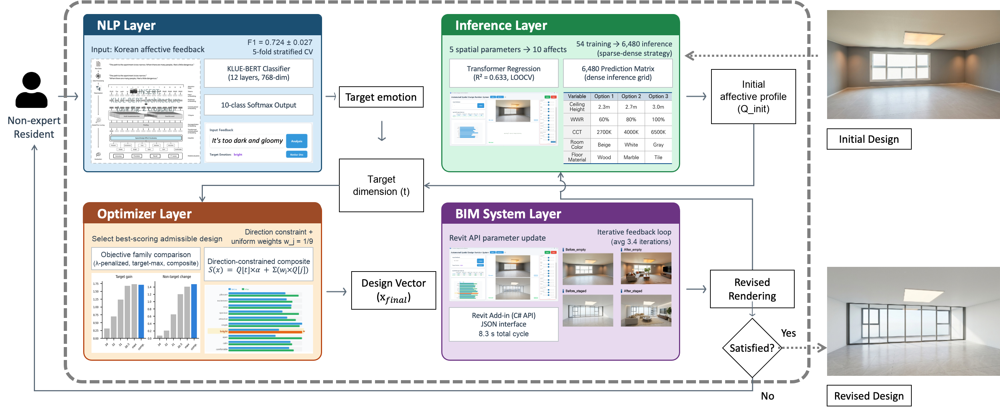

# Affective BIM design revision (ALIS)

This repository holds the code of my Ph.D. dissertation at Hanyang University (2026):
*Distribution-aware Affective Requirement Realignment for User Interactive Spatial Design Revision.*

ALIS (Architectural Language Interactive Synthesis) lets residents revise a BIM design in plain words.
A resident writes how a room should feel, for example "I want it to feel cozier."
The system reads the text, predicts how the current room feels, and selects a design
change that moves the room toward the requested feeling.
An Autodesk Revit add-in applies the change, and the resident accepts or rejects it.
The person always makes the final decision.



I built this work on my own, without project funding. The system was first built and tested in Korean,
so the text classifier reads Korean feedback.

## How it works

```
Revit model ──(C# add-in exports room parameters)──► current_analysis.txt
resident text ──► NLP.py (fine-tuned KLUE-BERT) ──► target feeling
current parameters ──► Inference.py (Transformer regressor) ──► 10-dimension affective profile
profile + target ──► Optimizer.py (search over 6,480 candidate designs) ──► design change
design change ──(C# add-in, Revit API)──► revised model, optional preview image (Rendering.py)
```

The ten affective dimensions are spacious, simple, bright, calm, comfortable, cozy,
open, pleasant, exciting and attractive. The design variables are ceiling height,
window-to-wall ratio, light colour temperature, wall colour and floor material.

`Optimizer.py` keeps only candidates that raise the target feeling and ranks them by a composite
score, 2 × target + mean of the other nine feelings. The ISARC 2026 paper formulated this step with
optimal transport. `analysis/objective_comparison.py` compares both rules.

## Folders

| Folder | Content |
|---|---|
| `revit-addin/` | C# add-in for Autodesk Revit 2023 (`IExternalApplication`, external event handler, WPF window) |
| `python/` | Inference, optimisation, text classification and rendering scripts called by the add-in; training scripts for the BERT and Transformer models, and an XGBoost baseline |
| `analysis/` | Two scripts that check the text classifier and the design-selection rules. See `analysis/README.md` |

## What is not included

This repository contains code only. No data, trained model weights or Autodesk binaries are included.
`RevitAPI.dll` and `RevitAPIUI.dll` are only referenced in `ALIS.csproj`, so you need a local Revit 2023
installation to build the add-in. The base language model `klue/bert-base` is loaded from Hugging Face.

## Requirements

- Windows with Autodesk Revit 2023 and .NET Framework 4.8 (add-in)
- Python 3.10 or later (`pip install -r analysis/requirements.txt`)
- Optional: a Gemini API key in the environment variable `GEMINI_API_KEY` for preview rendering

The add-in and the Python scripts exchange files through `C:\Temp`.

## Publications

- Im, J.-B., Hong, R.-L., Choi, C.-H., Ha, J.-E., & Kim, J.-H. (2026). Optimal transport-based affective user requirements realignment for automated minimal disruptive spatial design revision in BIM environment. *Proceedings of the 43rd ISARC*, Singapore. https://doi.org/10.22260/ISARC2026/0251
- Ph.D. dissertation, Hanyang University, August 2026.

## Licence

MIT. See `LICENSE`. Please cite the dissertation or the ISARC 2026 paper if you use this code.
